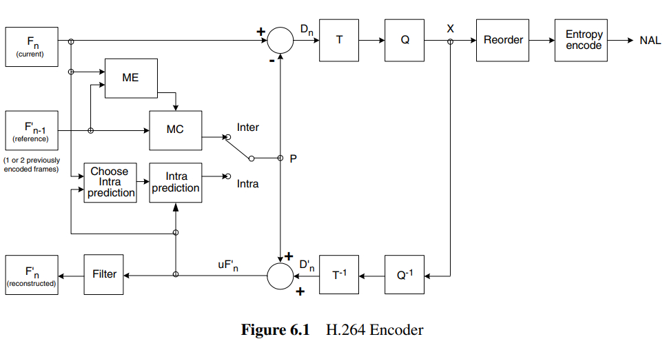

# H.264 编码原理知识总结

---

## 目录

1. [H.264 概述](#1-h264-概述)
2. [编码器全景图](#2-编码器全景图)
3. [视频编码基础概念](#3-视频编码基础概念)
4. [编码层级结构](#4-编码层级结构)
5. [帧内预测](#5-帧内预测)
6. [帧间预测](#6-帧间预测)
7. [残差编码技术](#7-残差编码技术)
8. [码流封装与传输](#8-码流封装与传输)
9. [档次与级别](#9-档次与级别)
10. [总结对比表](#10-总结对比表)

---

## 1. H.264 概述

### 1.1 什么是 H.264

- **全称**: Advanced Video Coding (AVC) / MPEG-4 Part 10
- **制定组织**: ITU-T VCEG + ISO/IEC MPEG 联合制定
- **发布时间**: 2003 年 5 月
- **核心目标**: 在相同画质下，码率比 MPEG-2 降低约 50%

### 1.2 核心优势

| 优势 | 说明 |
|------|------|
| **高压缩效率** | 相同画质下码率降低 50% |
| **广泛兼容** | 支持从手机到广播级的各种应用 |
| **网络友好** | 支持多种比特率，适应不同网络环境 |
| **抗误码特性** | 适合丢包率高的无线信道传输 |

### 1.3 应用领域

- 网络视频流媒体 (YouTube、Netflix)
- 高清电视广播
- 视频会议系统
- 视频监控
- 蓝光光盘
- 实时通信 (WebRTC)

---

## 2. 编码器全景图



**框图说明：**

上图展示了 H.264 编码器的完整结构，包含以下关键模块：

| 符号 | 模块名称 | 功能说明 |
|------|---------|---------|
| **Fₙ** | 当前帧 | 待编码的原始视频帧 |
| **F'ₙ₋₁** | 参考帧 | 已编码重建的前一帧（用于帧间预测） |
| **ME** | 运动估计 (Motion Estimation) | 在参考帧中搜索最佳匹配块，得到运动向量 |
| **MC** | 运动补偿 (Motion Compensation) | 根据运动向量从参考帧取出预测块 |
| **Intra prediction** | 帧内预测 | 利用空间相关性进行预测 |
| **Choose Intra prediction** | 帧内预测模式选择 | 选择最优的帧内预测方向 |
| **Inter/Intra** | 帧间/帧内选择开关 | 选择使用帧间或帧内预测 |
| **P** | 预测值 | 帧内或帧间预测得到的预测块 |
| **Dₙ** | 残差 | 当前帧与预测值的差值 |
| **T** | 变换 (Transform) | 整数 DCT 变换，将残差转换到频域 |
| **Q** | 量化 (Quantization) | 对变换系数进行量化 |
| **X** | 量化后的系数 | 待熵编码的数据 |
| **Reorder** | 重排序 | 对系数进行 Zig-zag 扫描重排序 |
| **Entropy encode** | 熵编码 | CAVLC 或 CABAC 编码 |
| **NAL** | NAL 单元输出 | 最终的编码输出 |
| **Q⁻¹** | 反量化 | 量化逆过程 |
| **T⁻¹** | 逆变换 | 变换逆过程 |
| **D'ₙ** | 重建残差 | 反量化逆变换后的残差 |
| **uF'ₙ** | 未滤波重建帧 | 预测值 + 重建残差 |
| **Filter** | 去块效应滤波器 | 消除块边界的不连续性 |
| **F'ₙ** | 重建帧 | 滤波后的参考帧，存入参考帧缓冲区 |

**编码流程：**

1. **预测阶段**：根据当前帧 Fₙ 和参考帧 F'ₙ₋₁，通过帧内预测或帧间预测生成预测值 P
2. **残差计算**：Dₙ = Fₙ - P
3. **变换量化**：对残差进行整数 DCT 变换 T 和量化 Q
4. **熵编码**：重排序后进行熵编码，输出 NAL 单元
5. **重建环路**：反量化 Q⁻¹、逆变换 T⁻¹ 得到重建残差，与预测值相加得到 uF'ₙ
6. **环路滤波**：经过去块效应滤波器得到重建帧 F'ₙ，存入参考帧缓冲区供后续帧使用

---

## 3. 视频编码基础概念

### 3.1 YUV 色彩空间与采样格式

H.264 使用 **YUV 色彩空间**（而非 RGB）进行编码，利用人眼对亮度敏感、对色度不敏感的特性进行压缩。

```
Y = 亮度（Luminance）    → 人眼高度敏感，保留全部细节
U = 蓝色色度（Cb）        → 人眼不敏感，可大幅压缩
V = 红色色度（Cr）        → 人眼不敏感，可大幅压缩

RGB → YUV 转换（简化）:
  Y = 0.299R + 0.587G + 0.114B
  U = 0.492(B - Y)
  V = 0.877(R - Y)
```

**三种采样格式**：

| 格式 | 说明 | 亮度:色度比 | 应用 |
|------|------|-----------|------|
| **4:4:4** | Y/U/V 各取一个样点 | 1:1:1 | 专业视频、无损编码 |
| **4:2:2** | 水平方向色度减半 | 2:1:1 | 广播级、专业制作 |
| **4:2:0** | 水平+垂直方向色度均减半 | 4:1:1 | **最常用**（消费级视频） |

**4:2:0 采样示意**：

```
亮度 Y (全分辨率):           色度 U/V (1/4 分辨率):
┌───┬───┬───┬───┐           ┌───────┬───────┐
│ Y │ Y │ Y │ Y │           │  U/V  │  U/V  │
├───┼───┼───┼───┤           └───────┴───────┘
│ Y │ Y │ Y │ Y │           ┌───────┬───────┐
├───┼───┼───┼───┤           │  U/V  │  U/V  │
│ Y │ Y │ Y │ Y │           └───────┴───────┘
├───┼───┼───┼───┤
│ Y │ Y │ Y │ Y │
└───┴───┴───┴───┘
 4×4 = 16 个样点              2×2 = 4 个样点

  色度数据量仅为亮度的 1/4 → 整体数据量减少约 50%
```

### 3.2 三种基本帧类型

```
时间轴:
  I        P        B        B        P        I
  │        │        │        │        │        │
  │帧内编码│帧间编码│帧间编码│帧间编码│帧间编码│帧内编码│
  │(全量)  │(前向)  │(双向)  │(双向)  │(前向)  │(全量)  │
  └────────┴────────┴────────┴────────┴────────┴────────┘
```

### 3.3 I 帧、P 帧、B 帧对比

| 属性 | I 帧（Intra-coded Frame） | P 帧（Predictive Frame） | B 帧（Bi-predictive Frame） |
|------|--------------------------|--------------------------|----------------------------|
| **编码方式** | 帧内编码，不参考任何其他帧 | 帧间编码，前向预测 | 帧间编码，双向预测 |
| **参考帧** | 无（独立编码） | 前面的 I 帧或 P 帧 | 同时参考前后帧 |
| **预测模式** | 4×4 帧内预测（9种方向）/ 16×16 帧内预测（4种模式） | 前向预测（List0）/ Skip 模式（MV=0） | List0 / List1 / 双向 / 直接模式 |
| **压缩比** | 低（约 7:1，类似 JPEG） | 中（约 20:1） | 高（可达 50:1） |
| **数据量** | 大 | 中 | 小 |
| **解码依赖** | 无 | 依赖前向帧 | 依赖前后帧 |
| **随机接入** | ✅ 支持 | ❌ 不支持 | ❌ 不支持 |
| **解码延迟** | 无 | 低 | 高（需缓冲未来帧） |
| **特点** | 独立解码，包含完整图像信息 | 存储运动向量 + 残差 | 压缩率最高，但解码复杂度最高 |
| **作用** | 随机接入点，错误恢复点 | 承接 I 帧后的连续动态画面 | 最大化压缩效率 |

**IDR 帧**: 特殊的 I 帧，其后的帧不能参考它之前的任何帧，用于解码器重新同步

### 3.4 GOP 结构

GOP（Group of Pictures，图像组）是视频编码的基本调度单元，由一个 I 帧开始，到下一个 I 帧之前的所有帧组成。

```
GOP 结构示例（IBBP 模式）:

  I    B    B    P    B    B    P    B    B    I
  │    │    │    │    │    │    │    │    │    │
  └────┴────┴────┴────┴────┴────┴────┴────┘    │
  ←────── GOP (9帧) ──────→                    │
                                               │
  └────┴────┴────┴────┴────┴────┴────┴────┴────┘
  ←────── GOP (10帧，含下一个I帧) ──────────────→
```

**GOP 关键参数**：

| 参数 | 说明 | 影响 |
|------|------|------|
| **GOP 大小** | 两个 I 帧之间的距离 | 越大压缩率越高，但随机接入越慢 |
| **GOP 结构** | I/P/B 帧的排列模式 | 影响压缩效率和延迟 |
| **封闭 GOP** | B 帧不参考 GOP 外的帧 | 可独立解码，适合随机接入 |
| **开放 GOP** | B 帧可跨 GOP 参考 | 压缩率略高，但不支持独立解码 |

**GOP 大小的权衡**：

| GOP 大小 | 优势 | 劣势 |
|---------|------|------|
| **小 GOP（1-2秒）** | 随机接入快，错误恢复快 | I 帧频繁，码率较高 |
| **大 GOP（5-10秒）** | 压缩效率高，码率低 | 随机接入慢，错误传播范围大 |

**常见 GOP 配置**：
- 直播推流：GOP = 1~2 秒（如 25fps 下 GOP=25~50）
- 视频点播：GOP = 2~5 秒
- 视频监控：GOP = 1~2 秒（快速随机接入）
- 蓝光光盘：GOP = 0.5~1 秒（高质量）

---

## 4. 编码层级结构

### 4.1 层级总览

```
编码层级关系:

  序列 (Sequence)
    └── 帧 (Frame / Picture)
          └── Slice (切片)
                └── 宏块 (Macroblock, 16×16)
                      └── 子块 (Sub-block, 4×4 / 8×8)
```

### 4.2 宏块结构

宏块（Macroblock）是 H.264 编码的**基本处理单元**，大小固定为 **16×16 像素**。

#### 4.2.1 宏块组成（4:2:0 采样）

每个宏块包含**一个亮度块 + 两个色度块**：

```
亮度 Y (16×16):              色度 Cb (8×8):           色度 Cr (8×8):
┌───┬───┬───┬───┐           ┌───────┬───────┐        ┌───────┬───────┐
│   │   │   │   │           │       │       │        │       │       │
├───┼───┼───┼───┤           │       │       │        │       │       │
│   │   │   │   │           └───────┴───────┘        └───────┴───────┘
├───┼───┼───┼───┤           ┌───────┬───────┐        ┌───────┬───────┐
│   │   │   │   │           │       │       │        │       │       │
├───┼───┼───┼───┤           │       │       │        │       │       │
│   │   │   │   │           └───────┴───────┘        └───────┴───────┘
├───┼───┼───┼───┤
│   │   │   │   │
├───┼───┼───┼───┤
│   │   │   │   │
├───┼───┼───┼───┤
│   │   │   │   │
├───┼───┼───┼───┤
│   │   │   │   │
└───┴───┴───┴───┘
  16×16 = 256 像素            8×8 = 64 像素           8×8 = 64 像素

  总计: 256 + 64 + 64 = 384 个样点
  4:2:0 采样下，色度分辨率是亮度的 1/4
```

#### 4.2.2 宏块的子块划分

亮度 16×16 宏块可以进一步划分为更小的子块：

```
16×16 宏块:
┌────┬────┬────┬────┐
│ 0  │ 1  │ 2  │ 3  │   4×4 子块编号 (共 16 个)
├────┼────┼────┼────┤
│ 4  │ 5  │ 6  │ 7  │
├────┼────┼────┼────┤
│ 8  │ 9  │ 10 │ 11 │
├────┼────┼────┼────┤
│ 12 │ 13 │ 14 │ 15 │
└────┴────┴────┴────┘

或划分为 8×8 子块 (共 4 个):
┌────────┬────────┐
│   0    │   1    │
├────────┼────────┤
│   2    │   3    │
└────────┴────────┘
```

#### 4.2.3 宏块类型

| 宏块类型 | 说明 | 允许的预测方式 |
|---------|------|--------------|
| **I_Macroblock** | 帧内编码宏块 | 仅帧内预测 |
| **P_Macroblock** | 前向预测宏块 | 帧内 + 前向帧间预测 |
| **B_Macroblock** | 双向预测宏块 | 帧内 + 前向/双向帧间预测 |
| **I_PCM** | 直接传输原始像素值 | 无预测，直接编码 PCM 样值 |
| **P_Skip** | 跳过宏块 | MV=0，无残差（零开销） |
| **B_Skip/B_Direct** | 跳过/直接模式 | MV 从相邻块推导，无残差 |

### 4.3 Slice 的定义与定位

Slice（切片）是 H.264 编码中**帧与宏块之间的中间层结构**，是一组按光栅扫描顺序排列的连续宏块。一个编码帧可以划分为一个或多个 Slice。

```
编码层级关系:

  序列 (Sequence)
    └── 帧 (Frame / Picture)
          └── Slice (切片)
                └── 宏块 (Macroblock, 16×16)
                      └── 子块 (Sub-block, 4×4 / 8×8)
```

**关键特性**：Slice 是**独立的可解码单元**，不同 Slice 之间不能跨 Slice 进行帧内预测（除非启用 FMO）。

### 4.4 Slice 的作用

| 作用 | 说明 |
|------|------|
| **错误隔离** | 一个 Slice 丢失或出错，不影响其他 Slice 的解码 |
| **并行解码** | 多个 Slice 可分配给不同解码线程并行处理 |
| **随机接入** | 解码器可以从任意 I Slice 开始独立解码 |
| **码率控制** | 通过 Slice 边界精确控制每个传输单元的大小 |
| **抗丢包** | 网络传输中，每个 Slice 可独立封装为一个 RTP 包 |

### 4.5 Slice 类型

Slice 类型由其内部宏块的编码方式决定，与帧类型（I/P/B）对应但更细粒度：

| Slice 类型 | NAL Type | 允许的宏块类型 | 说明 |
|-----------|----------|--------------|------|
| **I Slice** | 7 (IDR) / 5 (non-IDR) | 仅帧内预测宏块 | 完全独立，不参考任何其他帧 |
| **P Slice** | 1 | 帧内预测 + 前向帧间预测 | 可参考已解码的前向帧 |
| **B Slice** | 1 | 帧内预测 + 前向/双向帧间预测 | 可参考前后两个方向的帧 |

**注意**：一帧内可以混合使用不同类型的 Slice。例如一个 P 帧中，部分宏块组成 I Slice（用于错误恢复），其余组成 P Slice。

### 4.6 Slice 结构

每个 Slice 由**Slice Header**和**Slice Data**两部分组成：

```
┌──────────────────────────────────────────────────┐
│                   Slice                           │
│  ┌─────────────────┐  ┌───────────────────────┐  │
│  │  Slice Header   │  │     Slice Data        │  │
│  │                 │  │                       │  │
│  │ - slice_type    │  │  宏块0  宏块1  宏块2   │  │
│  │ - frame_num     │  │  ...   ...   ...      │  │
│  │ - idr_pic_id    │  │                       │  │
│  │ - pic_order_cnt │  │  (按光栅扫描顺序排列)   │  │
│  │ - ref_pic_list  │  │                       │  │
│  │ - slice_qp_delta│  │                       │  │
│  │ - deblocking    │  │                       │  │
│  └─────────────────┘  └───────────────────────┘  │
└──────────────────────────────────────────────────┘
```

**Slice Header 关键字段**：

| 字段 | 说明 |
|------|------|
| `slice_type` | Slice 类型（I/P/B/SP/SI） |
| `frame_num` | 帧号，用于参考帧管理 |
| `idr_pic_id` | IDR 帧标识（仅 IDR Slice 存在） |
| `pic_order_cnt` | 显示顺序（POC），决定帧的播放顺序 |
| `ref_pic_list_modification` | 参考帧列表修改指令 |
| `slice_qp_delta` | 当前 Slice 的 QP 偏移量（相对 PPS 中的初始 QP） |
| `deblocking_filter_control` | 去块效应滤波器控制参数 |

### 4.7 Slice 与帧的关系

一帧可以包含一个或多个 Slice，划分方式灵活：

```
情况1: 一帧一个 Slice（最常见）

  ┌────────────────────────────────┐
  │          Frame                 │
  │  ┌──────────────────────────┐  │
  │  │     Slice 0 (整帧)       │  │
  │  │  MB0 MB1 MB2 ... MB(N-1) │  │
  │  └──────────────────────────┘  │
  └────────────────────────────────┘

情况2: 一帧多个 Slice（按行划分）

  ┌────────────────────────────────┐
  │          Frame                 │
  │  ┌──────────────────────────┐  │
  │  │     Slice 0 (前半帧)     │  │
  │  ├──────────────────────────┤  │
  │  │     Slice 1 (后半帧)     │  │
  │  └──────────────────────────┘  │
  └────────────────────────────────┘

情况3: 一帧多个 Slice（交错划分）

  ┌────────────────────────────────┐
  │          Frame                 │
  │  ┌────────┬──────────────────┐ │
  │  │Slice 0│     Slice 1      │ │
  │  │(奇数行)│    (偶数行)      │ │
  │  ├────────┼──────────────────┤ │
  │  │Slice 2│     Slice 3      │ │
  │  │(奇数行)│    (偶数行)      │ │
  │  └────────┴──────────────────┘ │
  └────────────────────────────────┘
```

### 4.8 Slice Group 与 FMO

H.264 引入了**Slice Group（切片组）**和**FMO（Flexible Macroblock Ordering，灵活宏块排列）**机制，允许将宏块以非光栅扫描顺序分配到不同的 Slice Group 中。

#### 4.8.1 Slice Group

```
普通模式（无 FMO）:
  Slice Group 0 = 整帧所有宏块（按光栅扫描顺序）

FMO 模式:
  Slice Group 0: 宏块 0, 2, 4, 6, ...（偶数位置）
  Slice Group 1: 宏块 1, 3, 5, 7, ...（奇数位置）
```

#### 4.8.2 FMO 映射类型

| 映射类型 | 名称 | 说明 |
|---------|------|------|
| 0 | 交错扫描 | 宏块按棋盘格分配到不同 Slice Group |
| 1 | 散射扫描 | 每组分配指定数量的连续宏块 |
| 2 | 前景+剩余 | 指定矩形区域为前景组，其余为背景组 |
| 3 | 环形扫描 | 宏块按同心环分配 |
| 4 | 网格扫描 | 宏块按网格单元分配 |
| 5 | 显式映射 | 完全自定义每个宏块的组归属 |

**FMO 的典型应用**：

```
棋盘格模式（Type 0）用于抗丢包:

  ┌───┬───┬───┬───┬───┬───┐
  │ G0│ G1│ G0│ G1│ G0│ G1│   G0 = Slice Group 0
  ├───┼───┼───┼───┼───┼───┤   G1 = Slice Group 1
  │ G1│ G0│ G1│ G0│ G1│ G0│
  ├───┼───┼───┼───┼───┼───┤
  │ G0│ G1│ G0│ G1│ G0│ G1│
  ├───┼───┼───┼───┼───┼───┤
  │ G1│ G0│ G1│ G0│ G1│ G0│
  └───┴───┴───┴───┴───┴───┘

  丢失任一 Slice Group 后，另一组的宏块均匀分布，
  可利用空间插值恢复丢失区域，避免大面积画面损坏。
```

### 4.9 ASO 与冗余 Slice

#### 4.9.1 ASO（Arbitrary Slice Ordering）

- 允许 Slice **不按光栅扫描顺序**传输和解码
- 解码器根据 Slice Header 中的 `first_mb_in_slice` 确定每个 Slice 的位置
- 适用于不等保护传输（重要 Slice 优先发送）

#### 4.9.2 冗余 Slice（Redundant Slice）

- 对同一区域编码**两个 Slice**：一个主 Slice + 一个冗余 Slice
- 冗余 Slice 使用较低 QP（更高质量）但码率更大
- 解码时：主 Slice 正常则丢弃冗余 Slice；主 Slice 丢失则用冗余 Slice 替代

```
传输顺序:  Slice A (主)  →  Slice A' (冗余)  →  Slice B (主)  →  ...

解码端:
  Slice A 正常到达 → 使用 Slice A，丢弃 Slice A'
  Slice A 丢失     → 使用 Slice A' 恢复
```

### 4.10 Slice 边界对编码的影响

| 影响项 | 说明 |
|--------|------|
| **帧内预测** | 不能跨 Slice 边界参考像素（Slice 独立性） |
| **运动向量** | 不能跨 Slice 边界进行运动估计 |
| **去块效应滤波** | Slice 边界处滤波强度减弱或禁用 |
| **码率开销** | 每个 Slice 都有独立的 Header，Slice 越多开销越大 |
| **QP 调整** | 每个 Slice 可独立设置 QP 偏移量 |

### 4.11 Slice 大小的权衡

| Slice 大小 | 优势 | 劣势 |
|-----------|------|------|
| **大 Slice（整帧一个）** | Header 开销小，压缩效率高 | 抗误码能力差，一个包丢失整帧损坏 |
| **小 Slice（多个/帧）** | 抗误码能力强，适合丢包网络 | Header 开销大，压缩效率降低，跨边界预测受限 |

**实践经验**：
- 有线网络（低丢包率）→ 每帧 1 个 Slice，最大化压缩效率
- 无线网络（高丢包率）→ 每帧多个 Slice，增强抗误码能力
- 视频会议 → 每帧 1~2 个 Slice，平衡延迟和抗误码
- 直播推流 → 每帧 1 个 Slice（依赖应用层重传）

---

## 5. 帧内预测

### 5.1 帧内编码流程总览

```
┌─────────────────────────────────────────────────────────────────────┐
│                        帧内编码完整流程                               │
├─────────────────────────────────────────────────────────────────────┤
│                                                                     │
│   输入宏块 (16×16)                                                   │
│        │                                                            │
│        ▼                                                            │
│   ┌─────────────┐     ┌─────────────────────────────────────────┐   │
│   │  模式决策    │────→│ 方案A: 16×16 整体预测 (4种模式)          │   │
│   │  (RDO)      │     │ 方案B: 16个4×4子块分别预测 (各9种模式)    │   │
│   └─────────────┘     └─────────────────────────────────────────┘   │
│        │                                                            │
│        ▼                                                            │
│   执行帧内预测 ──→ 用上方/左侧已编码像素预测当前块                     │
│        │                                                            │
│        ▼                                                            │
│   计算残差 = 原始值 - 预测值                                          │
│        │                                                            │
│        ▼                                                            │
│   整数DCT变换 ──→ 4×4整数变换，能量集中到低频                          │
│        │                                                            │
│        ▼                                                            │
│   量化 ──→ 根据QP对系数取整，控制压缩率/质量                          │
│        │                                                            │
│        ▼                                                            │
│   重建环路 ──→ 反量化+逆DCT → 重建残差 → 预测值+残差 = 重建像素        │
│        │                    ↓                                       │
│        │              重建像素存入参考缓冲区                           │
│        │                    ↓                                       │
│        │              供后续子块预测使用                               │
│        ▼                                                            │
│   熵编码(CAVLC/CABAC) ──→ 输出NAL单元                                 │
│                                                                     │
└─────────────────────────────────────────────────────────────────────┘
```

**核心思想**: 利用空间相关性，用已编码的邻近像素预测当前块，只编码**预测残差**。

```
空间预测示意图:
┌─────────────────────────────────┐
│  已编码区域 (参考)               │
│  ┌───┬───┬───┬───┐              │
│  │ A │ B │ C │ D │ ← 上方已编码行 │
│  ├───┼───┼───┼───┤              │
│  │ E │ ? │ ? │ ? │ ← 当前待编码块 │
│  ├───┼───┼───┼───┤              │
│  │ F │ ? │ ? │ ? │              │
│  └───┴───┴───┴───┘              │
│       ↑ 左侧已编码列              │
└─────────────────────────────────┘

用 A~F 的值预测 ? → 只需编码很小的残差
```

### 5.2 帧内预测的"启动"机制

帧内预测依赖"已编码的邻近像素"作为参考，但**第一个块没有邻近像素可用**。H.264 通过**光栅扫描顺序**和**边界像素填充规则**解决这个冷启动问题。

#### 5.2.1 光栅扫描顺序

```
扫描顺序（4×4 子块级别）:

  ┌───┬───┬───┬───┐
  │ 0 │ 1 │ 2 │ 3 │      编码顺序: 0 → 1 → 2 → 3
  ├───┼───┼───┼───┤                    ↓
  │ 4 │ 5 │ 6 │ 7 │                    4 → 5 → 6 → 7
  ├───┼───┼───┼───┤                    ↓
  │ 8 │ 9 │10 │11 │                    ...
  ├───┼───┼───┼───┤
  │12 │13 │14 │15 │
  └───┴───┴───┴───┘

关键: 每个子块编码时，其上方和左侧的子块已经编码完成
```

#### 5.2.2 边界像素填充规则

当参考像素位于图像边界外或不可用时：

| 场景 | 处理方式 |
|------|---------|
| 左上角块（最左+最顶） | 所有参考像素用 **128**（中灰）填充 |
| 仅上方不可用 | 上方像素用左侧最上方像素值填充 |
| 仅左侧不可用 | 左侧像素用上方最左方像素值填充 |
| 跨越 Slice 边界 | 不可用，用 128 替代 |

**示例 — 左上角第一个子块**:
```
子块 0 的参考像素:
  - 上方: 不存在 → 用 128 填充
  - 左侧: 不存在 → 用 128 填充
  - 左上: 不存在 → 用 128 填充

  → 所有参考像素 = 128
  → 预测值 = 128（DC 模式）
  → 残差 = 原始像素值 - 128
```

### 5.3 帧内预测的"运转"机制

#### 5.3.1 重建像素反馈（防漂移核心）

帧内预测的参考像素**不是原始像素**，而是经过"编码→解码→重建"后的像素值：

```
原始像素 ──→ 帧内预测 ──→ 残差 ──→ DCT ──→ 量化 ──→ 熵编码
                │                              ↑
                │         ┌────────────────────┘
                │         ↓
                └──── 重建像素（反量化+逆DCT+预测值）
                          ↓
                    存入参考缓冲区
                          ↓
                    供下一个子块预测使用
```

**关键点**: 编码端和解码端使用**完全相同的重建像素**，避免漂移误差。

#### 5.3.2 逐块运转过程

```
步骤1: 编码子块 0
  ┌───┬───┬───┬───┐
  │[0]│   │   │   │   参考: 图像边界填充值(128)
  ├───┼───┼───┼───┤     → 预测 → 残差 → 量化 → 重建 → 存入缓冲区
  │   │   │   │   │
  └───┴───┴───┴───┘

步骤2: 编码子块 1
  ┌───┬───┬───┬───┐
  │ ✓ │[1]│   │   │   参考: 子块0的重建像素(下方一行) + 上方行
  ├───┼───┼───┼───┤     → 预测 → ... → 重建 → 存入缓冲区
  │ ✓ │   │   │   │
  └───┴───┴───┴───┘

步骤3: 编码子块 4（换行）
  ┌───┬───┬───┬───┐
  │ ✓ │ ✓ │ ✓ │ ✓ │   参考: 子块0的重建像素(右侧一列) + 左侧列
  ├───┼───┼───┼───┤
  │[4]│   │   │   │
  └───┴───┴───┴───┘

... 依此类推，直到子块 15 完成
```

#### 5.3.3 误差传播与控制

由于每个子块依赖前一个子块的**重建像素**，量化误差会逐块传播：

```
原始像素:  100  105  110  108
                ↓ 量化误差 +2
重建像素:  100  107  110  108
                      ↓ 传播
下一个子块参考的是 107 而非 105 → 误差累积
```

**控制手段**:
- **QP 不能过大**: 限制单次量化误差
- **帧内刷新**: 定期插入 I 宏块，切断误差传播链
- **去块效应滤波器**: 平滑子块边界

### 5.4 预测模式详解

#### 5.4.1 亮度 4×4 帧内预测（9 种方向）

```
方向示意图:

        ↑ 0 (Vertical)
         \
     8 ──┼── 3
         /│\
   7 ──/  │  \── 4
        \ │ /
     6 ──\│/── 5
          │
          ↓ 1 (Horizontal)

     2 = DC (无方向，取均值)
```

| 模式 | 名称 | 适用场景 |
|------|------|---------|
| 0 | Vertical | 水平边缘 |
| 1 | Horizontal | 垂直边缘 |
| 2 | DC | 平坦区域 |
| 3-8 | 对角线/偏角 | 纹理方向匹配 |

#### 5.4.2 亮度 16×16 帧内预测（4 种模式）

| 模式 | 名称 | 说明 | 适用场景 |
|------|------|------|---------|
| 0 | Vertical | 整行复制上方像素 | 水平边缘 |
| 1 | Horizontal | 整列复制左侧像素 | 垂直边缘 |
| 2 | DC | 上方和左侧平均值 | 平坦区域 |
| 3 | Plane | 线性平面拟合 | 亮度渐变区域 |

**Plane 模式数学原理**:
```
pred(x,y) = a + b·x + c·y

其中 a, b, c 由参考像素通过最小二乘法计算，
适合处理光照渐变等平滑过渡。
```

#### 5.4.3 色度 8×8 帧内预测（4 种模式）

- DC (0) - 平均值
- Horizontal (1) - 水平
- Vertical (2) - 垂直
- Plane (3) - 平面

### 5.5 模式选择决策

编码器对每个宏块进行**率失真优化（RDO）**决策：

```
┌─────────────────────────────────────────┐
│ 方案A: 16×16 整体预测                    │
│   - 4 种模式，选最优                      │
│   - 适合平坦区域                          │
│   - 模式开销小                            │
├─────────────────────────────────────────┤
│ 方案B: 16个 4×4 子块分别预测              │
│   - 每个子块 9 种模式，共 144 种组合       │
│   - 适合复杂纹理区域                      │
│   - 预测精度高，但模式开销大               │
├─────────────────────────────────────────┤
│ 决策: RDO 率失真优化                      │
│   J = D + λ · R  （失真 + 比特开销）       │
│   选 J 值最小的方案                        │
└─────────────────────────────────────────┘
```

---

## 6. 帧间预测

### 6.1 帧间编码流程总览

```
┌─────────────────────────────────────────────────────────────────────┐
│                        帧间编码完整流程                               │
├─────────────────────────────────────────────────────────────────────┤
│                                                                     │
│   输入: 当前帧 + 参考帧缓冲区                                         │
│        │                                                            │
│        ▼                                                            │
│   宏块划分决策（RDO 选择最优划分: 16×16 / 8×8 / 4×4）                  │
│        │                                                            │
│        ▼                                                            │
│   运动估计 ──→ 在参考帧中搜索最佳匹配块，得到运动向量(MV)               │
│        │                                                            │
│        ▼                                                            │
│   亚像素精度精化 ──→ 1/4 像素精度细化 MV                              │
│        │                                                            │
│        ▼                                                            │
│   运动补偿 ──→ 根据 MV 从参考帧取出预测值                              │
│        │                                                            │
│        ▼                                                            │
│   计算残差 = 原始值 - 预测值                                          │
│        │                                                            │
│        ▼                                                            │
│   整数DCT变换 ──→ 4×4整数变换，能量集中到低频                          │
│        │                                                            │
│        ▼                                                            │
│   量化 ──→ 根据QP对系数取整，控制压缩率/质量                          │
│        │                                                            │
│        ▼                                                            │
│   重建环路 ──→ 反量化+逆DCT → 重建残差 → 预测值+残差 = 重建像素        │
│        │                    ↓                                       │
│        │              重建像素存入参考帧缓冲区                         │
│        │                    ↓                                       │
│        │              供后续帧预测使用                                 │
│        ▼                                                            │
│   环路滤波 ──→ 去块效应滤波，平滑块边界                               │
│        │                                                            │
│        ▼                                                            │
│   熵编码(CAVLC/CABAC) ──→ 编码MV+量化系数 → 输出NAL单元              │
│                                                                     │
└─────────────────────────────────────────────────────────────────────┘
```

**核心思想**: 利用时间相关性，用参考帧预测当前帧，只编码**运动向量**和**预测残差**。

```
时间预测示意图:
  帧t-1 (参考帧)          帧 t (当前帧)
  ┌──────────┐            ┌──────────┐
  │   🚗     │            │      🚗  │  ← 汽车向右移动
  │          │    ──MV──→ │          │
  │  ☀️      │            │  ☀️      │  ← 背景不变
  └──────────┘            └──────────┘

  只需记录: 运动向量(MV) + 残差
```

### 6.2 运动估计

在参考帧中搜索与当前块**最匹配**的区域，得到**运动向量 (MV)**。

**搜索算法**:

| 算法 | 特点 |
|------|------|
| 全搜索 | 最精确，但计算量巨大 |
| 三步搜索 | 快速，可能陷入局部最优 |
| 菱形搜索 | 平衡速度和精度，应用广泛 |
| 六边形搜索 | x264 编码器默认使用 |

### 6.4 运动补偿

根据运动向量从参考帧中取出匹配块，作为当前块的预测值。

```
当前块原始值:              参考帧中匹配块:
┌───┬───┬───┬───┐        ┌───┬───┬───┬───┐
│100│105│ 98│102│        │100│104│ 97│101│
├───┼───┼───┼───┤        ├───┼───┼───┼───┤
│110│115│108│112│   MV→   │109│114│107│111│
├───┼───┼───┼───┤        ├───┼───┼───┼───┤
│ 95│ 98│ 92│ 96│        │ 94│ 97│ 91│ 95│
├───┼───┼───┼───┤        ├───┼───┼───┼───┤
│ 88│ 90│ 85│ 87│        │ 87│ 89│ 84│ 86│
└───┴───┴───┴───┘        └───┴───┴───┴───┘

残差 = 原始 - 预测（值很小，易于压缩）
```

### 6.5 亚像素精度

H.264 支持 **1/4 像素精度**的运动补偿：

**插值过程**:
1. **半像素插值**: 使用 6 点加权滤波器计算半像素位置
2. **1/4 像素插值**: 整数像素和半像素之间线性插值

```
整数像素位置:        1/4 像素位置:

  A    b    B    c    C
  │ ╲  │ ╱  │ ╲  │ ╱  │
  │  ╲ │╱   │  ╲ │╱   │
  d────h────e────i────j
  │ ╲  │ ╱  │ ╲  │ ╱  │
  │  ╲ │╱   │  ╲ │╱   │
  D────f────E────g────F

  A,B,C... = 整数像素
  b,c,d... = 半像素（1/2）
  其他位置 = 1/4 像素
```

### 6.6 多参考帧

H.264 允许使用**多个历史帧**作为参考：

```
帧序列:
  t-3    t-2    t-1    t (当前帧)
  ┌───┐  ┌───┐  ┌───┐  ┌───┐
  │ R0│  │ R1│  │ R2│  │ ? │
  └───┘  └───┘  └───┘  └───┘
   ↑      ↑      ↑
   └──────┴──────┴── 当前帧可以参考其中任意一帧
```

**优势**:
- 被遮挡的物体可能在更早的帧中可见
- 周期性运动可以参考更远的帧
- 提高预测质量，降低码率

#### 6.6.1 参考帧管理（DPB）

解码后的参考帧存储在 **DPB（Decoded Picture Buffer，解码图像缓冲区）** 中，由**参考帧管理机制**控制哪些帧保留、哪些帧丢弃。

**两种管理方式**：

| 方式 | 名称 | 原理 | 特点 |
|------|------|------|------|
| **滑动窗口** | Sliding Window | FIFO 先进先出，新帧替换最旧的帧 | 简单高效，SPS 中 `num_ref_frames` 决定窗口大小 |
| **MMCO** | Memory Management Control Operation | 显式命令控制帧的标记和删除 | 灵活，可实现非顺序参考帧管理 |

**MMCO 常用命令**：

| 命令 | 作用 |
|------|------|
| 0 | 结束 MMCO 操作 |
| 1 | 将当前帧标记为"非参考帧"（从参考列表中移除） |
| 2 | 将当前帧标记为"长期参考帧"（长期保留） |
| 3 | 删除指定的长期参考帧 |
| 5 | 清空所有参考帧列表，将当前帧标记为唯一短期参考帧（IDR 帧自动执行） |

### 6.7 Skip 模式

Skip 模式是 P/B 帧中的一种**零开销编码模式**，当宏块与参考帧完全相同（或差异可忽略）时使用。

#### P_Skip 模式

```
条件: 宏块的运动向量 MV = (0,0)，残差 = 0

编码: 不传输任何 MV 和残差数据，仅传输一个 Skip 标志位
解码: 直接复制参考帧同位置宏块

适用场景: 静止背景区域（如监控画面中不动的墙壁）
```

#### B_Skip / B_Direct 模式

```
条件: MV 从相邻已编码块的运动向量推导得出，残差 = 0

推导方式（Direct Mode）:
  MV_L0 = MV_A × scale_A + MV_B × scale_B  （空间/时间推导）
  MV_L1 = MV_C × scale_C + MV_D × scale_D

编码: 不传输 MV 和残差
解码: 根据推导规则计算 MV，从参考帧取预测值

适用场景: 匀速运动区域、被遮挡区域
```

**Skip 模式的价值**：
- 静止或匀速运动区域占视频面积的 60-80%
- Skip 模式用 **1 个比特** 替代完整的 MV + 残差编码
- 是 H.264 高压缩效率的重要贡献之一

### 6.8 宏块划分

H.264 支持**灵活的宏块划分**，不同大小的块可以有不同的运动向量：

```
16×16 宏块可以划分为:

┌───────────────┐    ┌───────┬───────┐    ┌───────────────┐
│               │    │       │       │    │       │       │
│    16×16      │    │ 16×8  │ 16×8  │    │  8×16 │  8×16 │
│   (1个MV)     │    │ (1MV) │ (1MV) │    │ (1MV) │ (1MV) │
│               │    │       │       │    │       │       │
└───────────────┘    └───────┴───────┘    └───────────────┘

┌───────┬───────┐    ┌───┬───┬───┬───┐
│ 8×8   │ 8×8   │    │4×4│4×4│4×4│4×4│
│       │       │    ├───┼───┼───┼───┤
│       │       │    │4×4│4×4│4×4│4×4│
├───────┼───────┤    ├───┼───┼───┼───┤
│ 8×8   │ 8×8   │    │4×4│4×4│4×4│4×4│
│       │       │    ├───┼───┼───┼───┤
│       │       │    │4×4│4×4│4×4│4×4│
└───────┴───────┘    └───┴───┴───┴───┘
 (4个MV)             (16个MV)
```

**权衡**: 块越小 → 运动描述越精确 → 但 MV 开销越大

### 6.9 P 帧与 B 帧预测

#### P 帧（前向预测）

```
参考帧 (过去)        当前帧 (P帧)
┌──────────┐        ┌──────────┐
│          │  ──→   │  预测值   │  +  残差  =  当前帧
│  Ref     │  MV    │          │
└──────────┘        └──────────┘

特点: 只参考过去的帧，每个宏块可以有 1 个 MV
```

#### B 帧（双向预测）

```
参考帧 (过去)        当前帧 (B帧)        参考帧 (未来)
┌──────────┐        ┌──────────┐        ┌──────────┐
│          │  ──→   │          │  ←──   │          │
│  Ref_L0  │  MV_L0 │  预测值  │  MV_L1 │  Ref_L1  │
└──────────┘        └──────────┘        └──────────┘

预测值 = α × List0预测 + β × List1预测

4 种预测模式:
  ① List0（仅前向参考）
  ② List1（仅后向参考）
  ③ 双向预测（前后加权平均）
  ④ 直接模式（Direct Mode，从前后MV推导）
```

---

## 7. 残差编码技术

预测（帧内/帧间）产生的残差信号需要经过**变换、量化、熵编码**三步才能形成最终码流，同时编码端还需维护一个**重建环路**为后续帧提供参考。

### 7.1 残差计算

残差是原始像素值与预测像素值之间的差值，是后续所有编码处理的基础。

```
残差 = 原始像素 - 预测像素

示例（帧间预测）:
  原始块:              预测块（来自参考帧）:
  ┌───┬───┬───┬───┐    ┌───┬───┬───┬───┐
  │160│162│155│158│    │158│160│153│156│
  ├───┼───┼───┼───┤    ├───┼───┼───┼───┤
  │170│168│163│165│    │168│166│161│163│
  ├───┼───┼───┼───┤    ├───┼───┼───┼───┤
  │150│148│145│142│    │148│146│143│140│
  ├───┼───┼───┼───┤    ├───┼───┼───┼───┤
  │140│138│135│132│    │138│136│133│130│
  └───┴───┴───┴───┘    └───┴───┴───┴───┘

  残差块:
  ┌───┬───┬───┬───┐
  │ +2│ +2│ +2│ +2│   ← 值很小且分布均匀
  ├───┼───┼───┼───┤
  │ +2│ +2│ +2│ +2│
  ├───┼───┼───┼───┤
  │ +2│ +2│ +2│ +2│
  ├───┼───┼───┼───┤
  │ +2│ +2│ +2│ +2│
  └───┴───┴───┴───┘

  预测越准确 → 残差越接近 0 → 压缩效率越高
```

**残差的统计特性**：
- 预测良好的残差信号中，大部分系数接近 0
- 非零系数主要集中在**低频区域**（左上角）
- 这种能量集中特性是后续 DCT 变换能有效压缩的基础

### 7.2 整数 DCT 变换

将残差从**空间域**转换到**频域**，使能量集中在少数低频系数上。

#### 7.2.1 为什么需要变换

```
空间域残差（像素值）:          频域变换后:
┌───┬───┬───┬───┐            ┌──────┬───┬───┬───┐
│ +2│ +2│ +2│ +2│            │ +8.0 │ 0 │ 0 │ 0 │  ← DC系数(低频)
├───┼───┼───┼───┤            ├──────┼───┼───┼───┤
│ +2│ +2│ +2│ +2│    DCT →   │  0   │ 0 │ 0 │ 0 │  ← AC系数(高频)
├───┼───┼───┼───┤            ├──────┼───┼───┼───┤
│ +2│ +2│ +2│ +2│            │  0   │ 0 │ 0 │ 0 │
├───┼───┼───┼───┤            ├──────┼───┼───┼───┤
│ +2│ +2│ +2│ +2│            │  0   │ 0 │ 0 │ 0 │
└───┴───┴───┴───┘            └──────┴───┴───┴───┘

  16个非零值                    仅1个非零值！
  → 量化后大部分高频系数变为 0   → 熵编码效率大幅提升
```

#### 7.2.2 H.264 整数变换的特点

| 特点 | 说明 |
|------|------|
| **4×4 块大小** | 比传统 8×8 DCT 更精细，减少块效应 |
| **整数运算** | 用整数矩阵替代浮点 DCT，避免浮点精度问题 |
| **精确可逆** | 编码端变换和解码端逆变换之间无舍入误差 |
| **等价于 DCT** | 数学上近似等价于传统 DCT，但计算更高效 |

**变换矩阵对比**：

```
传统浮点 DCT:                    H.264 整数变换:
┌──────────────────────┐        ┌────────────────────┐
│  1    1    1    1    │        │  1    1    1    1  │
│  a    b   -b   -a    │        │  2    1   -1   -2  │
│  1   -1   -1    1    │        │  1   -1   -1    1  │
│  b   -a    a   -b    │        │  1   -2    2   -1  │
└──────────────────────┘        └────────────────────┘
  a≈1.414, b≈0.707               全部为整数，仅需加法和移位
```

#### 7.2.3 变换过程

```
残差块 (4×4)                    变换系数 (4×4)
┌───┬───┬───┬───┐              ┌──────┬────┬────┬───┐
│r00│r01│r02│r03│              │ DC   │AC01│AC02│AC03│
├───┼───┼───┼───┤   整数DCT   ├──────┼────┼────┼───┤
│r10│r11│r12│r13│  ────────→  │ AC10 │AC11│AC12│AC13│
├───┼───┼───┼───┤              ├──────┼────┼────┼───┤
│r20│r21│r22│r23│              │ AC20 │AC21│AC22│AC23│
├───┼───┼───┼───┤              ├──────┼────┼────┼───┤
│r30│r31│r32│r33│              │ AC30 │AC31│AC32│AC33│
└───┴───┴───┴───┘              └──────┴────┴────┴───┘
 空间域残差                      频域系数
                                  ↑
                               DC = 直流分量(整体亮度)
                               AC = 交流分量(纹理细节)
```

#### 7.2.4 Hadamard 变换（DC 系数二次变换）

对于 16×16 帧内预测模式，H.264 还对 16 个 4×4 块的 DC 系数再做一次 **4×4 Hadamard 变换**，进一步集中能量：

```
16个4×4块的DC系数:           Hadamard变换后:
┌───┬───┬───┬───┐            ┌──────┬───┬───┬───┐
│DC0│DC1│DC2│DC3│            │ 总DC │ Δ1│ Δ2│ Δ3│  ← 总DC集中了
├───┼───┼───┼───┤   Hadamard ├──────┼───┼───┼───┤
│DC4│DC5│DC6│DC7│  ────────→ │  Δ4  │ 0 │ 0 │ 0 │  ← 差分趋近0
├───┼───┼───┼───┤            ├──────┼───┼───┼───┤
│DC8│DC9│DC10│DC11│           │  Δ5  │ 0 │ 0 │ 0 │
├───┼───┼───┼───┤            ├──────┼───┼───┼───┤
│DC12│DC13│DC14│DC15│         │  Δ6  │ 0 │ 0 │ 0 │
└───┴───┴───┴───┘            └──────┴───┴───┴───┘
```

### 7.3 量化

将变换后的频域系数进行**有损压缩**，是控制码率和画质的核心手段。

#### 7.3.1 量化原理

```
量化公式:
  level = round( |coef| / Qstep ) × sign(coef)

  coef  = 变换系数
  Qstep = 量化步长（由 QP 决定）
  level = 量化后的系数（整数）

量化步长 Qstep 与 QP 的关系:
  QP 每增加 6，Qstep 翻倍
  QP 每增加 1，码率大约减少 12.5%
```

**QP 与 Qstep 对照表**：

| QP | 0 | 1 | ... | 6 | ... | 12 | ... | 18 | ... | 51 |
|----|---|---|-----|---|-----|----|-----|----|-----|----|
| Qstep | 0.625 | 0.6875 | ... | 1.0 | ... | 2.0 | ... | 4.0 | ... | 224 |

#### 7.3.2 量化的效果

```
变换系数:                    QP=28 (中等量化):
┌──────┬────┬────┬───┐      ┌──────┬───┬───┬───┐
│ 320  │ 45 │ -12│  3│      │  20  │  3 │ -1 │  0│  ← 高频系数归零
├──────┼────┼────┼───┤      ├──────┼───┼───┼───┤
│ -30  │ 18 │  -5│  2│  →   │  -2  │  1 │  0 │  0│
├──────┼────┼────┼───┤      ├──────┼───┼───┼───┤
│  8   │ -6 │   3│ -1│      │   1  │  0 │  0 │  0│
├──────┼────┼────┼───┤      ├──────┼───┼───┼───┤
│ -3   │  2 │  -1│  1│      │   0  │  0 │  0 │  0│
└──────┴────┴────┴───┘      └──────┴───┴───┴───┘
 16个非零值                   6个非零值 → 熵编码更高效

QP=40 (重度量化):
┌──────┬───┬───┬───┐
│   5  │  0 │  0 │  0│      仅1个非零值 → 极高压缩率
├──────┼───┼───┼───┤      但重建质量明显下降
│   0  │  0 │  0 │  0│
├──────┼───┼───┼───┤
│   0  │  0 │  0 │  0│
├──────┼───┼───┼───┤
│   0  │  0 │  0 │  0│
└──────┴───┴───┴───┘
```

#### 7.3.3 量化参数 QP 的控制策略

| 策略 | 说明 |
|------|------|
| **恒定 QP** | 全局使用固定 QP，码率波动大，画质稳定 |
| **CBR 码率控制** | 根据目标码率动态调整 QP，画质随复杂度波动 |
| **ABR 平均码率** | 在一定窗口内控制平均码率，平衡画质和码率 |
| **宏块级 QP** | 每个宏块可独立调整 QP（通过 `mb_type` 或 `slice_qp_delta`），复杂区域用小 QP，平坦区域用大 QP |

#### 7.3.4 量化矩阵（Quantization Matrix）

H.264 High Profile 支持**自定义量化矩阵**，对不同频率位置的系数使用不同量化权重：

```
默认量化权重矩阵（Intra）:
┌────┬────┬────┬────┐
│ 16 │ 16 │ 16 │ 16 │  ← DC 系数，保留更多精度
├────┼────┼────┼────┤
│ 16 │ 16 │ 16 │ 16 │
├────┼────┼────┼────┤
│ 16 │ 16 │ 16 │ 16 │
├────┼────┼────┼────┤
│ 16 │ 16 │ 16 │ 16 │
└────┴────┴────┴────┘

自定义量化权重矩阵（高频加重量化）:
┌────┬────┬────┬────┐
│ 10 │ 14 │ 16 │ 18 │  ← 低频保留更多
├────┼────┼────┼────┤
│ 14 │ 16 │ 18 │ 20 │
├────┼────┼────┼────┤
│ 16 │ 18 │ 20 │ 22 │
├────┼────┼────┼────┤
│ 18 │ 20 │ 22 │ 24 │  ← 高频量化更重
└────┴────┴────┴────┘
```

### 7.4 熵编码

将量化后的系数和运动向量等语法元素转换为**最终比特流**，消除统计冗余。

#### 7.4.1 CAVLC（上下文自适应变长编码）

**基本原理**：为不同概率分布的语法元素分配不同长度的变长码，高频出现的数据用短码，低频的用长码。

**编码过程**：

```
量化系数: [20, 3, -1, 0, 0, -2, 1, 0, 0, 0, 1, 0, 0, 0, 0, 0]
                    ↓
步骤1: Zig-zag 扫描重排序（将非零系数集中到前面）
                    ↓
步骤2: 编码非零系数个数 (TotalCoeff) 和尾部零个数 (TrailingOnes)
                    ↓
步骤3: 编码每个非零系数的绝对值 (Level)
                    ↓
步骤4: 编码零系数的游程长度 (Run)
                    ↓
步骤5: 输出比特流
```

**Zig-zag 扫描顺序**：

```
┌──────┬──────┬──────┬──────┐
│ (0,0)│→(0,1)│ (1,0)│      │
│  DC  │      │      │      │
├──────┼──────┼──────┼──────┤
│      │ (2,0)│→(1,1)│→(0,2)│
│      │      │      │      │
├──────┼──────┼──────┼──────┤
│ (3,0)│ (2,1)│ (1,2)│→(0,3)│
│      │      │      │      │
├──────┼──────┼──────┼──────┤
│      │ (3,1)│ (2,2)│ (1,3)│
│      │      │      │      │
└──────┴──────┴──────┴──────┘

从低频(左上)到高频(右下)扫描
→ 非零系数集中在扫描序列前端
→ 后续大量连续的0可用游程编码高效压缩
```

**"上下文自适应"的含义**：根据**已编码的相邻块**的非零系数数量，动态切换码表，使编码更贴合当前数据的统计特性。

#### 7.4.2 CABAC（上下文自适应二进制算术编码）

**基本原理**：将所有语法元素转换为二进制序列，使用算术编码根据概率模型动态分配比特。

**编码过程**：

```
语法元素（如量化系数）
         ↓
二值化（Binarization）
  将数值转换为二进制串
  例: level=5 → "00101"（一元截断码）
         ↓
上下文建模（Context Modeling）
  根据已编码的邻近信息选择概率模型
  例: 左块和上块的非零系数多 → 当前块大概率也有非零系数
         ↓
算术编码（Arithmetic Coding）
  根据概率模型将二进制位压缩为比特流
  概率高的位 → 占用更少的比特
  概率低的位 → 占用更多的比特
         ↓
概率模型更新（Probability Update）
  每编码一个符号后更新概率模型
  → 自适应跟踪数据的统计变化
```

**CABAC vs CAVLC 对比**：

| 对比项 | CAVLC | CABAC |
|--------|-------|-------|
| 编码方式 | 变长码（整数倍比特） | 算术码（接近理论极限） |
| 压缩效率 | 基准 | **高 10-15%** |
| 计算复杂度 | 低 | 高（约 2-3 倍） |
| 上下文自适应 | 仅系数编码 | **所有语法元素** |
| 概率模型 | 码表切换 | 连续概率更新 |
| 适用 Profile | Baseline / Main / High | **Main / High** |

### 7.5 重建环路

重建环路是 H.264 编码器的核心机制之一，确保编码端和解码端产生**完全一致**的参考帧。

#### 7.5.1 为什么需要重建环路

```
❌ 如果编码端直接用原始帧作为参考:

  编码端: 原始帧 → 预测 → 残差 → 量化 → 码流
              ↑
              └── 用原始帧预测（精确）

  解码端: 码流 → 反量化 → 残差 → 预测 → 重建帧
                                     ↑
                                     └── 用重建帧预测（有量化误差）

  → 编码端和解码端的参考帧不一致！
  → 误差逐帧累积（漂移），画质迅速恶化
```

```
✅ 编码端内置解码环路:

  编码端: 原始帧 → 预测 → 残差 → 变换 → 量化 → 熵编码 → 码流
                                              ↓
                                          反量化 → 逆变换 → 重建残差
                                              ↓
                                    预测值 + 重建残差 = 重建帧
                                              ↓
                                    重建帧 → 存入参考帧缓冲区
                                              ↓
                                    供后续帧预测使用（与解码端完全一致）
```

#### 7.5.2 重建环路完整流程

```
┌──────────────────────────────────────────────────────────────┐
│                      重建环路                                 │
│                                                              │
│   预测值 P ──────────┐                                       │
│                       │                                       │
│   原始帧 Fₙ ─┬───────┤                                       │
│              │       │                                       │
│              ▼       ▼                                       │
│           残差 D = Fₙ - P                                    │
│              │                                               │
│              ▼                                               │
│           整数DCT变换 ──→ 变换系数 T                          │
│              │                                               │
│              ▼                                               │
│           量化 ──→ 量化系数 Q                                 │
│              │                                               │
│         ┌────┴────┐                                          │
│         ▼         ▼                                          │
│      熵编码     反量化 Q⁻¹                                   │
│      (输出)         │                                        │
│                    ▼                                         │
│                 逆变换 T⁻¹                                   │
│                    │                                         │
│                    ▼                                         │
│                 重建残差 D'                                   │
│                    │                                         │
│                    ▼                                         │
│              重建帧 F'ₙ = P + D'                             │
│                    │                                         │
│                    ▼                                         │
│              ┌─────┴─────┐                                   │
│              ▼           ▼                                   │
│         环路滤波      参考帧缓冲区                             │
│         (去块效应)    (供后续帧使用)                            │
│                                                              │
└──────────────────────────────────────────────────────────────┘
```

**关键等式**：`F'ₙ = P + Q⁻¹(T⁻¹(Q(T(Fₙ - P))))`

编码端和解码端执行完全相同的 `Q⁻¹(T⁻¹(Q(T(·))))` 操作，确保参考帧一致。

### 7.6 环路滤波（去块效应滤波器）

由于分块编码和量化，块边界处会出现不连续的"阶梯效应"，环路滤波器用于消除这种失真。

#### 7.6.1 块效应的成因

```
块A (QP=28):          块B (QP=32):
┌───┬───┬───┬───┐    ┌───┬───┬───┬───┐
│120│122│118│115│    │112│108│105│100│  ← QP不同导致边界跳变
├───┼───┼───┼───┤    ├───┼───┼───┼───┤
│125│128│120│116│    │110│106│102│ 98│
└───┴───┴───┴───┘    └───┴───┴───┴───┘
                    ↑
              边界处值突变: 115 → 112 (差3)
              视觉上表现为"方块"痕迹
```

#### 7.6.2 滤波强度决策

滤波器根据**边界强度（Boundary Strength, BS）**决定滤波程度：

| BS 值 | 条件 | 滤波强度 |
|-------|------|---------|
| **4** | 边界两侧有一个是帧内编码宏块 | **最强**（跨5个像素） |
| **3** | 边界两侧运动向量不同 | 强（跨4个像素） |
| **2** | 边界两侧参考帧不同或量化参数差 ≥ 4 | 中等（跨3个像素） |
| **1** | 边界两侧残差系数非零 | 弱（跨2个像素） |
| **0** | 边界两侧运动一致且无残差 | **不滤波** |

#### 7.6.3 滤波过程

```
滤波前:                    滤波后:
  p3  p2  p1  p0 │ q0  q1  q2  q3    p3  p2  p1  p0'│q0'  q1'  q2  q3
                  ↑边界↑                  ↑ 边界更平滑 ↑

  p0, p1 = 边界左侧像素
  q0, q1 = 边界右侧像素

  滤波公式（BS=1, 简化）:
    Δ = clip( ( (q0 - p0) × 4 - (p1 - q1) + 4 ) >> 3, -tc, tc )
    p0' = p0 + Δ
    q0' = q0 - Δ

  clip 函数确保修正值不超过阈值 tc，避免过度平滑
```

#### 7.6.4 "环路"滤波的含义

```
"环路" = 在编码/解码环路内部执行

  编码端: 重建帧 → 环路滤波 → 滤波后的帧存入参考帧缓冲区
  解码端: 重建帧 → 环路滤波 → 滤波后的帧存入参考帧缓冲区

  → 编码端和解码端执行完全相同的滤波
  → 滤波后的帧作为后续帧的参考
  → 这意味着滤波不仅改善显示质量，还影响后续帧的预测和压缩效率
```

---

## 8. 码流封装与传输

### 8.1 完整层级关系

```
SODB → RBSP → EBSP → NAL Unit → 码流
```

| 层级 | 全称 | 说明 |
|------|------|------|
| **SODB** | String of Data Bits | 编码器原始输出，比特级，长度任意 |
| **RBSP** | Raw Byte Sequence Payload | SODB + 尾部填充（补 1 + 补 0 对齐到字节） |
| **EBSP** | Encapsulated Byte Sequence Payload | RBSP + 防竞争字节 0x03 |
| **NAL Unit** | Network Abstraction Layer Unit | EBSP + NAL 头部（1 字节） |

### 8.2 层级关系图示

```
┌─────────────────────────────────────────────────────────┐
│                      NAL Unit                           │
│  ┌───────┐  ┌──────────────────────────────────────┐   │
│  │Header │  │           EBSP                        │   │
│  │1 byte │  │  ┌────────────────────────────────┐  │   │
│  │       │  │  │         RBSP                    │  │   │
│  │       │  │  │  ┌──────────────────────────┐  │  │   │
│  │       │  │  │  │       SODB               │  │  │   │
│  │       │  │  │  │  (编码器原始比特串)        │  │  │   │
│  │       │  │  │  └──────────────────────────┘  │  │   │
│  │       │  │  │  + 尾部填充 (1 + 0...0)        │  │  │   │
│  │       │  │  └────────────────────────────────┘  │   │
│  │       │  │  + 防竞争字节 (0x03)                  │   │
│  └───────┘  └──────────────────────────────────────┘   │
└─────────────────────────────────────────────────────────┘
```

### 8.3 SODB、RBSP、EBSP 详解

#### 8.3.1 SODB（数据比特串）

**定义**: 编码器经过预测、变换、量化、熵编码后产出的**原始比特串**

**特点**:
- 精确到比特（bit），不是字节
- 长度不一定是 8 的倍数
- 无任何填充、无任何封装
- 由 CABAC 或 CAVLC 熵编码器直接输出

#### 8.3.2 RBSP（原始字节序列载荷）

**定义**: SODB 加上**尾部填充**，使其对齐到字节边界

**尾部填充规则**:
```
在 SODB 末尾: 先写一个 1，再补 0 直到字节对齐
```

**示例**:
```
SODB:     1 0 1 1 0 0 1 0  |  0 1 1 0 1
          ←── 8 bits ──→     ← 5 bits →   共 13 bits

RBSP:     1 0 1 1 0 0 1 0  |  0 1 1 0 1  1  0  0
          ←── 8 bits ──→     ←── 8 bits ──→   共 16 bits
                                        ↑  ↑  ↑
                                        1  0  0  ← 尾部填充
```

**补 1 的原因**: 作为停止标志位，防止尾部连续 0 与起始码 `0x000001` 混淆

#### 8.3.3 EBSP（封装字节序列载荷）

**定义**: RBSP 加上**防竞争字节**，防止数据中出现假的起始码

**防竞争字节插入规则**:
```
当 RBSP 中出现 0x00 0x00 后跟 ≤ 0x03 的字节时，在第二个 0x00 后插入 0x03
```

**插入场景**:

| RBSP 原始模式 | EBSP 结果 | 说明 |
|--------------|----------|------|
| `00 00 00` | `00 00 03 00` | 插入 03 |
| `00 00 01` | `00 00 03 01` | 防止伪装成起始码 |
| `00 00 02` | `00 00 03 02` | 插入 03 |
| `00 00 03` | `00 00 03 03` | 插入 03 |
| `00 00 04` | `00 00 04` | 不插入（04 不会与起始码混淆） |

**示例**:
```
RBSP:  00 00 01 A3 7C 00 00 00 80
       ↓ 插入防竞争字节
EBSP:  00 00 03 01 A3 7C 00 00 03 00 80
           ↑              ↑
        插入 03        插入 03
```

**解码器处理**: 遇到 `0x00 0x00 0x03` 时自动删除 `0x03`，还原 RBSP

### 8.4 SPS 与 PPS

SPS（Sequence Parameter Set，序列参数集）和 PPS（Picture Parameter Set，图像参数集）是 H.264 码流中**最关键的配置信息**，解码器必须先解析 SPS/PPS 才能解码视频数据。

#### 8.4.1 SPS（序列参数集）

SPS 包含整个视频序列的**全局参数**，一个序列通常只有一个 SPS。

**核心字段**：

| 字段 | 说明 | 示例 |
|------|------|------|
| `profile_idc` | 编码档次（66=Baseline, 77=Main, 100=High） | 100 |
| `level_idc` | 编码级别（10~51） | 40 |
| `seq_parameter_set_id` | SPS 的编号（0~31），PPS 通过此 ID 引用 SPS | 0 |
| `pic_width_in_mbs_minus1` | 图像宽度（以宏块为单位 - 1） | 119 → 120×16=1920 |
| `pic_height_in_map_units_minus1` | 图像高度（以宏块为单位 - 1） | 67 → 68×16=1088 |
| `frame_mbs_only_flag` | 是否仅包含帧（非隔行） | 1 |
| `direct_8x8_inference_flag` | B 帧直接模式是否使用 8×8 变换 | 1 |
| `num_ref_frames` | 最大参考帧数 | 4 |
| `gaps_in_frame_num_value_allowed_flag` | 是否允许帧号不连续 | 0 |
| `chroma_format_idc` | 色度采样格式（1=4:2:0） | 1 |
| `bit_depth_luma_minus8` | 亮度位深（0=8bit） | 0 |
| `bit_depth_chroma_minus8` | 色度位深（0=8bit） | 0 |
| `vui_parameters_present_flag` | 是否包含 VUI 参数（SAR、timing 等） | 1 |

#### 8.4.2 PPS（图像参数集）

PPS 包含每帧图像的**编码参数**，可以多个 PPS 对应同一个 SPS。

**核心字段**：

| 字段 | 说明 | 示例 |
|------|------|------|
| `pic_parameter_set_id` | PPS 的编号（0~255），Slice 通过此 ID 引用 PPS | 0 |
| `seq_parameter_set_id` | 引用的 SPS 编号 | 0 |
| `entropy_coding_mode_flag` | 熵编码方式（0=CAVLC, 1=CABAC） | 1 |
| `bottom_field_pic_order_in_frame_present_flag` | 帧场编码相关 | 0 |
| `num_slice_groups_minus1` | Slice Group 数量 - 1 | 0 |
| `num_ref_idx_l0_default_active_minus1` | P 帧默认参考帧数 - 1 | 0 |
| `num_ref_idx_l1_default_active_minus1` | B 帧默认 L1 参考帧数 - 1 | 0 |
| `weighted_pred_flag` | P 帧是否使用加权预测 | 0 |
| `weighted_bipred_idc` | B 帧加权预测方式 | 0 |
| `pic_init_qp_minus26` | 初始 QP 偏移（实际 QP = 26 + 此值） | 0 |
| `deblocking_filter_control_present_flag` | 是否启用去块效应滤波控制 | 1 |
| `constrained_intra_pred_flag` | 是否约束帧内预测（仅用帧内编码宏块作参考） | 0 |
| `redundant_pic_cnt_present_flag` | 是否支持冗余 Slice | 0 |
| `transform_8x8_mode_flag` | 是否允许 8×8 变换（High Profile） | 1 |

#### 8.4.3 SPS/PPS 在码流中的位置

```
典型 H.264 码流（Annex B 格式）:

  00 00 00 01  67  ...    ← 起始码 + SPS (NAL Type=7, 0x67)
  00 00 00 01  68  ...    ← 起始码 + PPS (NAL Type=8, 0x68)
  00 00 00 01  65  ...    ← 起始码 + IDR Slice (NAL Type=5, 0x65)
  00 00 00 01  41  ...    ← 起始码 + P Slice (NAL Type=1, 0x41)
  ...

  解码顺序: SPS → PPS → IDR → P/B → ...
  缺少 SPS 或 PPS → 解码器无法解码
```

#### 8.4.4 SPS/PPS 的传输策略

| 策略 | 说明 |
|------|------|
| **每个 IDR 前重复** | 最安全，确保随机接入时解码器有完整参数 |
| **带外传输** | 通过 SDP/MP4 容器等通道单独传递，减少码流冗余 |
| **参数集更新** | 编码中途可发送新的 SPS/PPS 切换编码参数 |

### 8.5 NAL Unit 头部

#### 8.5.1 结构（1 字节）

```
Bit:   7    6    5    4    3    2    1    0
     ┌────┬────┬────┬────┬────┬────┬────┬────┐
     │ F  │    NRI    │         Type          │
     │1bit│   2bit    │        5bit           │
     └────┴────┴────┴────┴────┴────┴────┴────┘
```

#### 8.5.2 字段详解

##### forbidden_zero_bit (F) - 禁止位
- **位数**: 1 bit
- **取值**: 必须为 0
- **含义**: F=1 表示该 NAL Unit 存在语法错误，应丢弃

##### nal_ref_idc (NRI) - 重要性指示
- **位数**: 2 bits
- **取值**: 00 ~ 11 (0 ~ 3)
- **含义**: 值越大越重要，网络拥塞时优先保留高 NRI 的包

| NRI | 含义 | 对应帧类型 |
|-----|------|-----------|
| 00 | 不重要，可丢弃 | 非参考 B 帧 |
| 01 | 较低重要性 | 非参考 P/B 帧 |
| 10 | 较高重要性 | 非参考 I 帧或参考 P 帧 |
| 11 | 非常重要 | 参考帧、SPS、PPS |

##### nal_unit_type (Type) - NAL 单元类型
- **位数**: 5 bits
- **取值**: 0 ~ 31

#### 8.5.3 常见 NAL 类型

| Type | 名称 | 说明 | NRI |
|------|------|------|-----|
| 1 | 非 IDR Slice | P/B/I Slice 数据 | 0~2 |
| 5 | **IDR Slice** | 即时解码刷新图像片 | **3** |
| 6 | SEI | 补充增强信息 | 0~3 |
| 7 | **SPS** | 序列参数集 | **3** |
| 8 | **PPS** | 图像参数集 | **3** |
| 9 | AUD | 访问单元分隔符 | 0 |

#### 8.5.4 常见头部字节示例

| 十六进制 | 二进制 | F | NRI | Type | 含义 |
|---------|--------|---|-----|------|------|
| 0x67 | 0 11 00111 | 0 | 3 | 7 | SPS |
| 0x68 | 0 11 01000 | 0 | 3 | 8 | PPS |
| 0x65 | 0 11 00101 | 0 | 3 | 5 | IDR Slice |
| 0x41 | 0 10 00001 | 0 | 2 | 1 | P Slice |
| 0x01 | 0 00 00001 | 0 | 0 | 1 | B Slice |

---

## 9. 档次与级别

### 9.1 主要档次（Profile）

| 档次 | 特点 | 应用场景 |
|------|------|---------|
| **Baseline** | 基本功能，I/P 帧，CAVLC，无 B 帧 | 视频通话、移动设备 |
| **Extended** | 支持 SP/SI 帧，FMO，ASO | 流媒体、网络视频 |
| **Main** | 支持 CABAC，B 帧，隔行视频 | 标清电视、DVD |
| **High** | 最高质量，支持 8×8 变换，4:2:2/4:4:4 采样 | 高清电视、蓝光 |

### 9.2 级别（Level）

级别定义了解码器的处理能力限制，包括：
- 最大分辨率
- 最大帧率
- 最大码率
- 最大参考帧数

**常见级别**:

| Level | 最大分辨率 | 典型应用 |
|-------|-----------|---------|
| 1.0 | QCIF (176×144) | 手机 |
| 2.1 | CIF (352×288) | 标清视频 |
| 3.0 | SD (720×480) | 标清电视 |
| 4.0 | HD (1920×1080@30fps) | 高清电视 |
| 5.0 | 2K (2048×1024) | 数字影院 |
| 5.1 | 4K (3840×2160@30fps) | 超高清 |

---

## 10. 总结对比表

### 10.1 码流层级对比

| 层级 | 全称 | 核心操作 | 输出格式 |
|------|------|---------|---------|
| SODB | String of Data Bits | 熵编码器原始输出 | 任意长度比特串 |
| RBSP | Raw Byte Sequence Payload | SODB + 尾部填充（补 1 + 补 0） | 字节对齐 |
| EBSP | Encapsulated Byte Sequence Payload | RBSP + 防竞争字节 0x03 | 无假起始码 |
| NAL Unit | Network Abstraction Layer Unit | EBSP + NAL Header | 可传输单元 |

### 10.2 帧类型对比

| 对比项 | I 帧 | P 帧 | B 帧 |
|--------|------|------|------|
| 编码方式 | 帧内编码 | 帧间编码（前向） | 帧间编码（双向） |
| 压缩比 | ~7:1 | ~20:1 | ~50:1 |
| 数据量 | 大 | 中 | 小 |
| 解码依赖 | 无 | 前向帧 | 前后帧 |
| 随机接入 | ✅ | ❌ | ❌ |
| 解码延迟 | 无 | 低 | 高 |

### 10.3 帧内 vs 帧间编码对比

| 对比维度 | 帧内编码 | 帧间编码 |
|---------|---------|---------|
| 参考范围 | 当前帧内部 | 前向帧 / 双向帧 |
| 消除冗余 | 空间冗余 | 时间冗余 |
| 帧类型 | I 帧 | P 帧、B 帧 |
| 压缩比 | 较低 | 较高 |
| 随机接入 | ✅ 支持 | ❌ 不支持 |
| 抗误码 | ✅ 强 | ❌ 弱（错误传播） |
| 预测方向 | 空间方向 | 时间方向（运动向量） |
| 计算复杂度 | 中等 | 高（运动估计） |

### 10.4 核心技术要点

| 技术 | 作用 | 关键参数/特点 |
|------|------|--------------|
| 整数 DCT 变换 | 能量集中 | 4×4 或 8×8 块 |
| 量化 | 控制压缩率/质量 | 量化参数 QP |
| 熵编码 | 消除统计冗余 | CAVLC / CABAC |
| 运动估计 | 寻找最佳匹配 | 搜索算法、精度 |
| 运动补偿 | 生成预测值 | 1/4 像素精度 |
| 多参考帧 | 提高预测质量 | 可引用多个历史帧 |
| 去块效应滤波 | 提高主观质量 | 环路内滤波 |

---

## 附录：关键术语速查

| 术语 | 英文全称 | 中文含义 |
|------|---------|---------|
| SODB | String of Data Bits | 数据比特串 |
| RBSP | Raw Byte Sequence Payload | 原始字节序列载荷 |
| EBSP | Encapsulated Byte Sequence Payload | 封装字节序列载荷 |
| NAL | Network Abstraction Layer | 网络抽象层 |
| VCL | Video Coding Layer | 视频编码层 |
| SPS | Sequence Parameter Set | 序列参数集 |
| PPS | Picture Parameter Set | 图像参数集 |
| SEI | Supplemental Enhancement Information | 补充增强信息 |
| IDR | Instantaneous Decoding Refresh | 即时解码刷新 |
| GOP | Group of Pictures | 图像组 |
| MV | Motion Vector | 运动向量 |
| ME | Motion Estimation | 运动估计 |
| MC | Motion Compensation | 运动补偿 |
| RDO | Rate-Distortion Optimization | 率失真优化 |
| QP | Quantization Parameter | 量化参数 |
| CABAC | Context-Adaptive Binary Arithmetic Coding | 上下文自适应二进制算术编码 |
| CAVLC | Context-Adaptive Variable Length Coding | 上下文自适应变长编码 |
| SPS | Sequence Parameter Set | 序列参数集 |
| PPS | Picture Parameter Set | 图像参数集 |
| DPB | Decoded Picture Buffer | 解码图像缓冲区 |
| GOP | Group of Pictures | 图像组 |
| YUV | Luminance + Chrominance | 亮度+色度色彩空间 |
| FMO | Flexible Macroblock Ordering | 灵活宏块排列 |
| ASO | Arbitrary Slice Ordering | 任意切片顺序 |
| MMCO | Memory Management Control Operation | 内存管理控制操作 |
| VUI | Video Usability Information | 视频可用性信息 |

---

*文档生成时间: 2026-05-16*
*基于 H.264/AVC 标准整理*
